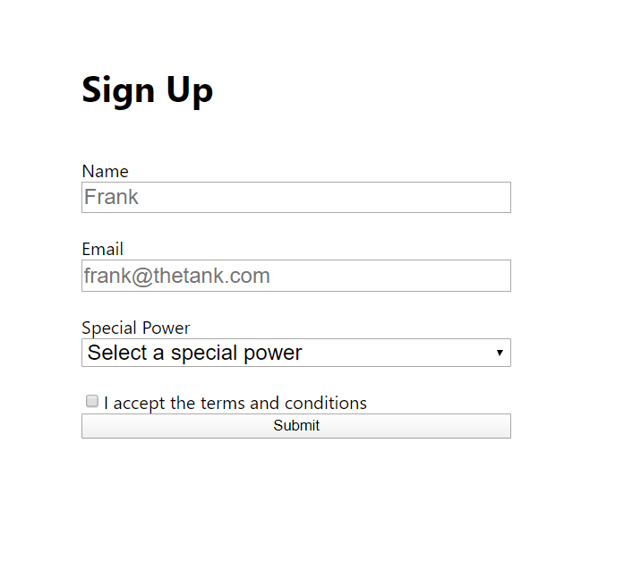
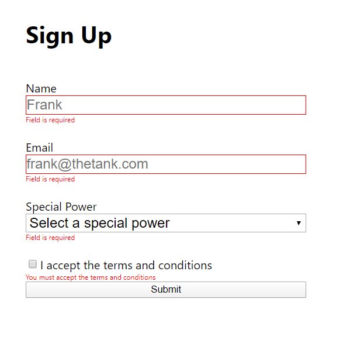

Este projeto visa falar um pouco da biblioteca formik.

Esta biblioteca é uma alternativa ao redux-form para controlar formulários em React e, além de ser de fácil implementação, usa a biblioteca yup para fazer a validação do formulário. O Yup utiliza o conceito do Prop-type para declaração das regras de validação.

## Instalação

yarn add formik yup

## codificação

```
import { Formik, useField, Form } from 'formik';
import * as Yup from 'yup';
```

Retornar uma estrutura Formik como a seguir:

```
<Formik
    initialValues={{
        name: '',
        email: '',
        acceptedTerms: false,
        specialPower: ''
    }}
    validationSchema={Yup.object({
        name: Yup.string()
            .min(3, 'Must be at least 3 characters')
            .max(15, 'Must be 15 characters or less')
            .required('Field is required'),
        email: Yup.string()
            .email('Invalid Email address')
            .required('Field is required'),
        acceptedTerms: Yup.boolean()
            .required('Field is required')
            .oneOf([true], 'You must accept the terms and conditions'),
        specialPower: Yup.string()
            .oneOf(
                ['flight', 'invisibility', 'Wealthy bad guy', 'other'],
                'Invalid special power'
            )
            .required('Field is required')
    })}
    onSubmit={(values, { setSubmitting, resetForm }) => {
        //Chamar a action
        setTimeout(() => {
            alert(JSON.stringify(values, null, 2));
            resetForm();
            setSubmitting(false);
        }, 3000);
    }}
>
    {(props) => (
        <Form>
        ...
        </Form>
    )}
</Formik>
```

### Execução - `yarn start`

Para executar este rode o comando `yarn start` e abra o navegador em: [http://localhost:3000](http://localhost:3000).

### View

#### Formulário



#### Formulário validado


